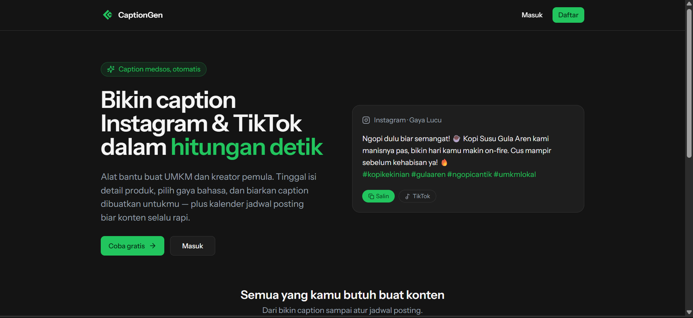
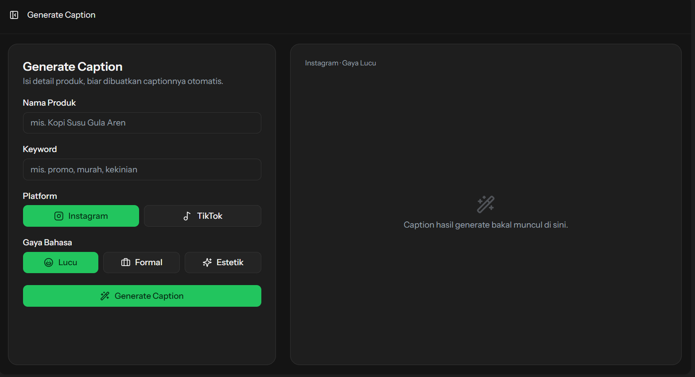

# CaptionGen

Dashboard manajemen konten & otomasi caption media sosial untuk UMKM dan konten kreator
pemula. Tinggal isi nama produk, keyword, pilih platform (Instagram/TikTok), dan gaya
bahasa — caption langsung dibuatkan lewat Gemini API. Ada juga katalog konten dengan
kalender jadwal posting dan tombol salin caption.

## Tampilan

**Landing page**



**Generate caption**



## Fitur

- Login & register
- Generate caption otomatis (nama produk, keyword, platform, gaya bahasa)
- Salin caption ke clipboard sekali klik
- Katalog konten: grid kartu dengan thumbnail foto/video, ikon platform, dan badge status
- Kalender jadwal posting (CRUD): tambah, ubah, hapus jadwal
- Upload foto atau video sebagai thumbnail tiap konten
- Dashboard ringkasan: total konten, jadwal terdekat, dan konten terbaru

## Tech Stack

- **Backend:** Laravel
- **Frontend:** React + TypeScript lewat Inertia
- **UI:** shadcn/ui + Tailwind CSS (tema hijau + dark)
- **Database:** MySQL
- **Generate caption:** Gemini API (HTTP client bawaan Laravel)

## Cara Menjalankan

Butuh PHP, Composer, dan Node.js.

1. Clone repo lalu install dependency:

   ```bash
   composer install
   npm install
   ```

2. Siapkan file environment:

   ```bash
   cp .env.example .env
   php artisan key:generate
   ```

3. Isi API key Gemini di `.env`:

   ```env
   GEMINI_API_KEY=punya-kamu
   GEMINI_MODEL=gemini-2.5-flash
   ```

4. Buat database MySQL bernama `captsgen` (pakai MySQL bawaan Herd, user `root`
   tanpa password), lalu jalankan migrasi & storage link:

   ```bash
   php artisan migrate --seed
   php artisan storage:link
   ```

5. Jalankan asset frontend:

   ```bash
   npm run dev
   ```

   Herd otomatis serve situsnya di `http://captsgen.test`. Kalau nggak pakai Herd,
   jalanin `php artisan serve` lalu buka `http://localhost:8000`.

## Testing

```bash
php artisan test
```
